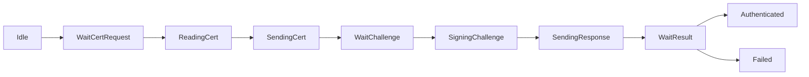
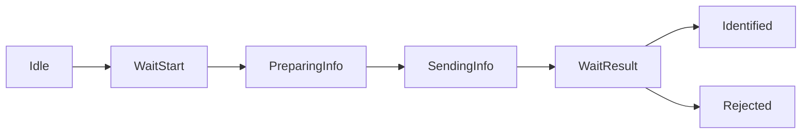

# iAP2协议栈模块详细说明

## 目录

1. [iAP2Adapt - 适配层](#1-iap2adapt---适配层)
2. [iAP2Session - 会话层](#2-iap2session---会话层)
3. [iAP2Link - Link层](#3-iap2link---link层)
4. [iAP2Transport - 传输层](#4-iap2transport---传输层)
5. [iAP2Utility - 工具层](#5-iap2utility---工具层)
6. [Driver - 硬件驱动](#6-driver---硬件驱动)

---

## 1. iAP2Adapt - 适配层

### 1.1 模块概述

**位置**: `iAP2Adapt/`  
**文件**: `iAP2Adapt.c`, `iAP2Adapt.h`

**职责**：
- 提供统一的上层接口
- 简化iAP2协议栈的使用
- 封装底层复杂性
- 管理连接生命周期

### 1.2 核心接口

```c
// 连接建立
int iAP2AdaptOnConnected(
    int type,                           // 传输类型（蓝牙/USB）
    iAP2SessionDataCB_t sessionDataCB,  // 会话数据回调
    iAP2TransportSendDataCB_t sendDataCB, // 发送数据回调
    void *context                       // 用户上下文
);

// 连接断开
void iAP2AdaptOnDisconnected(void);

// 数据处理
int iAP2AdaptDataHandler(
    unsigned char *data,  // 接收到的数据
    unsigned int len      // 数据长度
);
```

### 1.3 使用示例

```c
// 蓝牙连接建立时
void OnBluetoothConnected(void) {
    iAP2AdaptOnConnected(
        kIAP2TransportTypeBluetooth,
        MySessionDataCallback,
        MyBluetoothSendCallback,
        &myContext
    );
}

// 接收到蓝牙数据
void OnBluetoothDataReceived(uint8_t *data, uint32_t len) {
    iAP2AdaptDataHandler(data, len);
}

// 蓝牙断开
void OnBluetoothDisconnected(void) {
    iAP2AdaptOnDisconnected();
}
```

### 1.4 内部实现

- 创建和管理Transport实例
- 创建和管理Session实例
- 路由数据到正确的模块
- 处理连接状态变化

---

## 2. iAP2Session - 会话层

### 2.1 模块概述

**位置**: `iAP2Session/`  
**文件**: 
- `iAP2Session.c/h` - 会话管理器
- `iAP2Authentication.c/h` - 认证模块
- `iAP2Identification.c/h` - 识别模块
- `iAP2CPTask.c/h` - CP任务管理
- `iAP2ControlCodec.c/h` - 消息编解码
- `iAP2ControlMessage.h` - 消息定义

**职责**：
- 管理Control、EA、Buffer会话
- 处理MFi认证流程
- 处理配件识别流程
- 编解码控制消息
- 管理CP异步操作

### 2.2 会话管理器 (iAP2Session)

#### 状态定义

```c
typedef enum {
    kIAP2SessionStateIdle,          // 空闲
    kIAP2SessionStateWaitLink,      // 等待Link建立
    kIAP2SessionStateAuthenticating,// 认证中
    kIAP2SessionStateIdentifying,   // 识别中
    kIAP2SessionStateReady,         // 就绪
    kIAP2SessionStateFailed         // 失败
} iAP2SessionState_t;
```

#### 核心接口

```c
// 创建会话管理器
iAP2Session_t* iAP2SessionCreate(
    const iAP2SessionConfig_t *config,
    uint8_t type  // 传输类型
);

// 启动会话
BOOL iAP2SessionStart(iAP2Session_t *session);

// 发送数据
BOOL iAP2SessionSendData(
    iAP2Session_t *session,
    uint8_t sessionID,
    const uint8_t *data,
    uint32_t dataLen
);

// 状态查询
BOOL iAP2SessionIsAuthenticated(iAP2Session_t *session);
BOOL iAP2SessionIsIdentified(iAP2Session_t *session);
BOOL iAP2SessionIsReady(iAP2Session_t *session);
```

### 2.3 认证模块 (iAP2Authentication)

#### 认证流程



#### 认证消息

| 消息ID | 名称 | 方向 | 说明 |
|--------|------|------|------|
| 0xAA00 | RequestAuthCertificate | Device→Accessory | 请求证书 |
| 0xAA01 | AuthCertificate | Accessory→Device | 发送证书 |
| 0xAA02 | RequestAuthChallenge | Device→Accessory | 请求签名挑战 |
| 0xAA03 | AuthResponse | Accessory→Device | 发送签名响应 |
| 0xAA04 | AuthFailed | Device→Accessory | 认证失败 |
| 0xAA05 | AuthSucceeded | Device→Accessory | 认证成功 |

#### CP操作

```c
// CP任务类型
typedef enum {
    kIAP2CPTaskTypeReadCert,      // 读取证书
    kIAP2CPTaskTypeSignChallenge, // 签名挑战
    kIAP2CPTaskTypeReadSerial     // 读取序列号
} iAP2CPTaskType_t;

// 异步操作
void iAP2CPTaskStart(
    iAP2CPTaskType_t type,
    const uint8_t *input,
    uint32_t inputLen,
    iAP2CPTaskCompleteCB_t callback,
    void *context
);
```

### 2.4 识别模块 (iAP2Identification)

#### 识别流程



#### 识别消息

| 消息ID | 名称 | 方向 | 说明 |
|--------|------|------|------|
| 0x1D00 | StartIdentification | Device→Accessory | 开始识别 |
| 0x1D01 | IdentificationInformation | Accessory→Device | 配件信息 |
| 0x1D02 | IdentificationAccepted | Device→Accessory | 识别接受 |
| 0x1D03 | IdentificationRejected | Device→Accessory | 识别拒绝 |

#### 配件信息

```c
typedef struct {
    // 基本信息
    const char *name;              // 配件名称
    const char *modelIdentifier;   // 型号
    const char *manufacturer;      // 制造商
    const char *serialNumber;      // 序列号
    const char *firmwareVersion;   // 固件版本
    const char *hardwareVersion;   // 硬件版本
    
    // EA协议
    iAP2EAProtocol_t *eaProtocols;
    uint8_t eaProtocolCount;
    
    // 蓝牙传输
    iAP2BTTransport_t *btTransports;
    uint8_t btTransportCount;
    
    // 消息能力
    uint16_t *supportedMessages;
    uint16_t supportedMessageCount;
} iAP2AccessoryInfo_t;
```

### 2.5 控制编解码 (iAP2ControlCodec)

#### 编码接口

```c
// 初始化编码器
void ctrlSess_BuilderInit(
    ctrlSessBuilder_t *builder,
    uint8_t *buffer,
    uint32_t bufferSize,
    uint16_t messageId
);

// 添加参数
void ctrlSess_AddBool(ctrlSessBuilder_t *builder, uint16_t paramId, BOOL value);
void ctrlSess_AddUint8(ctrlSessBuilder_t *builder, uint16_t paramId, uint8_t value);
void ctrlSess_AddUint16(ctrlSessBuilder_t *builder, uint16_t paramId, uint16_t value);
void ctrlSess_AddUint32(ctrlSessBuilder_t *builder, uint16_t paramId, uint32_t value);
void ctrlSess_AddString(ctrlSessBuilder_t *builder, uint16_t paramId, const char *value);
void ctrlSess_AddBlob(ctrlSessBuilder_t *builder, uint16_t paramId, 
                      const uint8_t *data, uint32_t len);

// 完成编码
uint16_t ctrlSess_BuilderFinish(ctrlSessBuilder_t *builder);
```

#### 解码接口

```c
// 解码消息头
int ctrlSess_DecodeMessageHeader(
    const uint8_t *data,
    uint32_t dataLen,
    ctrlSessMessage_t *msg
);

// 获取下一个参数
int ctrlSess_GetNextParameter(
    const uint8_t *data,
    uint32_t dataLen,
    ctrlSessParameter_t *param
);

// 参数类型
typedef enum {
    kCtrlSessParamTypeBool,
    kCtrlSessParamTypeUint8,
    kCtrlSessParamTypeUint16,
    kCtrlSessParamTypeUint32,
    kCtrlSessParamTypeUint64,
    kCtrlSessParamTypeString,
    kCtrlSessParamTypeBlob,
    kCtrlSessParamTypeArray,
    kCtrlSessParamTypeGroup
} ctrlSessParamType_t;
```

#### 使用示例

```c
// 编码示例
uint8_t buffer[1024];
ctrlSessBuilder_t builder;

ctrlSess_BuilderInit(&builder, buffer, sizeof(buffer), 0x1D01);
ctrlSess_AddString(&builder, 0x0001, "My Accessory");
ctrlSess_AddString(&builder, 0x0002, "Model-2024");
ctrlSess_AddString(&builder, 0x0003, "My Company");
uint16_t msgLen = ctrlSess_BuilderFinish(&builder);

// 解码示例
ctrlSessMessage_t msg;
ctrlSess_DecodeMessageHeader(data, len, &msg);

const uint8_t *ptr = data + msg.headerLen;
uint32_t remaining = len - msg.headerLen;

while (remaining > 0) {
    ctrlSessParameter param;
    int consumed = ctrlSess_GetNextParameter(ptr, remaining, &param);
    
    switch (param.type) {
        case kCtrlSessParamTypeString:
            printf("String: %s\n", param.value.stringValue);
            break;
        case kCtrlSessParamTypeUint16:
            printf("Uint16: %u\n", param.value.uint16Value);
            break;
        // ...
    }
    
    ptr += consumed;
    remaining -= consumed;
}
```

---

## 3. iAP2Link - Link层

### 3.1 模块概述

**位置**: `iAP2Link/`  
**文件**:
- `iAP2Link.c/h` - Link核心
- `iAP2Packet.c/h` - 数据包管理
- `iAP2LinkRunLoop.c/h` - 运行循环
- `iAP2FileTransfer.c/h` - 文件传输（示例）

**职责**：
- 可靠数据传输
- 序列号管理
- ACK/重传机制
- 流量控制
- 会话复用

### 3.2 Link核心 (iAP2Link)

#### Link状态

```c
typedef enum {
    kiAP2LinkStateInit,       // 初始化
    kiAP2LinkStateDetached,   // 分离
    kiAP2LinkStateDetect,     // 检测
    kiAP2LinkStateIdle,       // 空闲（协商中）
    kiAP2LinkStatePending,    // 等待（仅Device）
    kiAP2LinkStateConnected,  // 已连接
    kiAP2LinkStateSuspend,    // 挂起
    kiAP2LinkStateFailed      // 失败
} kiAP2LinkState_t;
```

#### Link事件

```c
typedef enum {
    kiAP2LinkEventInitDone,         // 初始化完成
    kiAP2LinkEventAttach,           // 连接
    kiAP2LinkEventRecvSYN,          // 收到SYN
    kiAP2LinkEventRecvSYNACK,       // 收到SYN-ACK
    kiAP2LinkEventRecvRST,          // 收到RST
    kiAP2LinkEventWaitACKTimeout,   // 等待ACK超时
    kiAP2LinkEventSendACKTimeout,   // 发送ACK超时
    kiAP2LinkEventDetach,           // 断开
    kiAP2LinkEventRecvData,         // 收到数据
    kiAP2LinkEventEAK,              // 收到EAK
    kiAP2LinkEventDataToSend,       // 有数据要发送
    kiAP2LinkEventMaxResend,        // 达到最大重传次数
    kiAP2LinkEventRecvACK,          // 收到ACK
    kiAP2LinkEventRecvDetect,       // 收到DETECT
    kiAP2LinkEventSuspend           // 挂起
} iAP2LinkEvent_t;
```

#### SYN参数

```c
typedef struct {
    uint8_t  version;               // 协议版本
    uint8_t  maxOutstandingPackets; // 最大未确认包数
    uint8_t  maxRetransmissions;    // 最大重传次数
    uint8_t  maxCumAck;             // 最大累积确认
    uint16_t maxPacketSize;         // 最大包大小
    uint16_t retransmitTimeout;     // 重传超时(ms)
    uint16_t cumAckTimeout;         // 累积确认超时(ms)
    uint8_t  numSessionInfo;        // 会话信息数量
    iAP2PacketSessionInfo_t sessionInfo[kIAP2PacketMaxSessions];
} iAP2PacketSYNData_t;
```

#### 核心接口

```c
// 创建Link
iAP2Link_t* iAP2LinkCreateAccessory(
    iAP2PacketSYNData_t *synParam,
    void *context,
    iAP2LinkSendPacketCB_t sendPacketCB,
    iAP2LinkDataReadyCB_t recvDataCB,
    iAP2LinkConnectedCB_t connectedCB,
    iAP2LinkSendDetectCB_t sendDetectCB,
    iAP2LinkSignalSendBuffCB_t signalSendBuffCB,
    BOOL bValidateSYN,
    uint8_t maxPacketSentAtOnce,
    uint8_t *linkBuffer
);

// 启动Link
void iAP2LinkStart(iAP2Link_t *link);

// 连接/断开
void iAP2LinkAttached(iAP2Link_t *link);
void iAP2LinkDetached(iAP2Link_t *link);

// 发送数据
BOOL iAP2LinkQueueSendData(
    iAP2Link_t *link,
    const uint8_t *payload,
    uint32_t payloadLen,
    uint8_t session,
    void *context,
    iAP2LinkDataSentCB_t callback
);

// 接收数据包
void iAP2LinkHandleReadyPacket(
    iAP2Link_t *link,
    iAP2Packet_t *packet
);
```

### 3.3 数据包管理 (iAP2Packet)

#### 数据包格式

```
Byte 0: 0xFF (Start of Packet MSB)
Byte 1: 0x5A (Start of Packet LSB)
Byte 2-3: Packet Length (Big Endian)
Byte 4: Control Flags
  Bit 7: SYN
  Bit 6: ACK
  Bit 5: EAK
  Bit 4: RST
  Bit 3: SUS
Byte 5: Sequence Number
Byte 6: Acknowledgement Number
Byte 7: Session ID
Byte 8: Header Checksum
Byte 9-N: Payload Data
Byte N+1: Payload Checksum
```

#### 数据包类型

```c
// 控制标志
#define kIAP2PacketControlMaskSYN 0x80  // 同步
#define kIAP2PacketControlMaskACK 0x40  // 确认
#define kIAP2PacketControlMaskEAK 0x20  // 扩展确认
#define kIAP2PacketControlMaskRST 0x10  // 重置
#define kIAP2PacketControlMaskSUS 0x08  // 挂起
```

#### 核心接口

```c
// 创建接收包
iAP2Packet_t* iAP2PacketCreateEmptyRecvPacket(void *link);

// 创建发送包
iAP2Packet_t* iAP2PacketCreateEmptySendPacket(void *link);

// 解析数据
uint32_t iAP2PacketParseBuffer(
    const uint8_t *buffer,
    uint32_t bufferLen,
    iAP2Packet_t *packet,
    uint32_t maxPacketSize,
    BOOL *bDetect,
    uint32_t *failedChecksums,
    uint32_t *sopDetect
);

// 检查包是否完整
BOOL iAP2PacketIsComplete(const iAP2Packet_t *pck);

// 生成发送缓冲
uint8_t* iAP2PacketGenerateBuffer(iAP2Packet_t *packet);

// 创建特殊包
iAP2Packet_t* iAP2PacketCreateSYNPacket(...);
iAP2Packet_t* iAP2PacketCreateACKPacket(...);
iAP2Packet_t* iAP2PacketCreateEAKPacket(...);
iAP2Packet_t* iAP2PacketCreateRSTPacket(...);
iAP2Packet_t* iAP2PacketCreateSUSPacket(...);

// 删除包
void iAP2PacketDelete(iAP2Packet_t *pck);
```

#### 使用示例

```c
// 接收数据流程
iAP2Packet_t *packet = iAP2PacketCreateEmptyRecvPacket(link);

while (有数据) {
    uint32_t parsed = iAP2PacketParseBuffer(
        buffer, bufferLen, packet, maxPacketSize, 
        &bDetect, NULL, NULL
    );
    
    if (iAP2PacketIsComplete(packet)) {
        // 处理完整的包
        iAP2LinkHandleReadyPacket(link, packet);
        
        // 创建新包继续接收
        packet = iAP2PacketCreateEmptyRecvPacket(link);
    }
}

// 发送数据流程
iAP2Packet_t *packet = iAP2PacketCreateACKPacket(
    link, seq, ack, payload, payloadLen, session
);

uint8_t *buffer = iAP2PacketGenerateBuffer(packet);
SendToPhysicalLayer(buffer, packet->packetLen);
```

### 3.4 运行循环 (iAP2LinkRunLoop)

#### 核心接口

```c
// 创建运行循环
iAP2LinkRunLoop_t* iAP2LinkRunLoopCreateAccessory(
    iAP2PacketSYNData_t *synParam,
    void *context,
    iAP2LinkSendPacketCB_t sendPacketCB,
    iAP2LinkDataReadyCB_t recvDataCB,
    iAP2LinkConnectedCB_t connectedCB,
    iAP2LinkSendDetectCB_t sendDetectCB,
    BOOL bValidateSYN,
    uint8_t maxPacketSentAtOnce,
    uint8_t *linkRLBuffer
);

// 运行一次
BOOL iAP2LinkRunLoopRunOnce(
    iAP2LinkRunLoop_t *linkRunLoop,
    void *arg
);

// 连接/断开
void iAP2LinkRunLoopAttached(iAP2LinkRunLoop_t *linkRunLoop);
void iAP2LinkRunLoopDetached(iAP2LinkRunLoop_t *linkRunLoop);

// 处理接收包
void iAP2LinkRunLoopHandleReadyPacket(
    iAP2LinkRunLoop_t *linkRunLoop,
    void *packetArg
);

// 队列发送数据
void iAP2LinkRunLoopQueueSendData(
    iAP2LinkRunLoop_t *linkRunLoop,
    const uint8_t *payload,
    uint32_t payloadLen,
    uint8_t session,
    void *context,
    iAP2LinkDataSentCB_t callback
);
```

#### 平台相关实现

需要实现以下函数：

```c
// 初始化
void iAP2LinkRunLoopInitImplementation(iAP2LinkRunLoop_t *linkRunLoop);

// 清理
void iAP2LinkRunLoopCleanupImplementation(iAP2LinkRunLoop_t *linkRunLoop);

// 等待信号
BOOL iAP2LinkRunLoopWait(iAP2LinkRunLoop_t *linkRunLoop);

// 发送信号
void iAP2LinkRunLoopSignal(iAP2LinkRunLoop_t *linkRunLoop, void *arg);

// 保护调用
BOOL iAP2LinkRunLoopProtectedCall(
    iAP2LinkRunLoop_t *linkRunLoop,
    void *arg,
    BOOL (*func)(iAP2LinkRunLoop_t *linkRunLoop, void *arg)
);
```

---

## 4. iAP2Transport - 传输层

### 4.1 模块概述

**位置**: `iAP2Transport/`  
**文件**: `iAP2Transport.c/h`

**职责**：
- 封装物理传输
- 管理Link层
- 提供统一接口
- 支持多种物理层

### 4.2 传输类型

```c
typedef enum {
    kIAP2TransportTypeBluetooth = 0,
    kIAP2TransportTypeUSB,
    kIAP2TransportTypeUART
} iAP2TransportType_t;
```

### 4.3 传输状态

```c
typedef enum {
    kIAP2TransportStateDisconnected = 0,
    kIAP2TransportStateConnecting,
    kIAP2TransportStateConnected,
    kIAP2TransportStateDisconnecting
} iAP2TransportState_t;
```

### 4.4 核心接口

```c
// 创建传输层
iAP2Transport_t* iAP2TransportCreate(
    const iAP2TransportConfig_t *config
);

// 销毁传输层
void iAP2TransportDestroy(iAP2Transport_t *transport);

// 连接管理
BOOL iAP2TransportConnect(iAP2Transport_t *transport);
void iAP2TransportDisconnect(iAP2Transport_t *transport);

// 数据收发
uint32_t iAP2TransportReceiveData(
    iAP2Transport_t *transport,
    const uint8_t *data,
    uint32_t dataLen
);

BOOL iAP2TransportSendData(
    iAP2Transport_t *transport,
    uint8_t sessionID,
    const uint8_t *data,
    uint32_t dataLen
);

// 处理循环
BOOL iAP2TransportProcess(iAP2Transport_t *transport);

// 状态查询
BOOL iAP2TransportIsConnected(iAP2Transport_t *transport);
iAP2TransportState_t iAP2TransportGetState(iAP2Transport_t *transport);
```

### 4.5 配置结构

```c
typedef struct {
    iAP2TransportType_t type;                    // 传输类型
    iAP2TransportSendDataCB_t sendDataCB;        // 发送回调
    iAP2TransportConnectionChangeCB_t connectionChangeCB; // 连接回调
    iAP2TransportDataReadyCB_t dataReadyCB;      // 数据回调
    iAP2TransportLinkConnectedCB_t linkConnectedCB; // Link连接回调
    void *callbackContext;                       // 回调上下文
    void *userContext;                           // 用户上下文
    uint16_t maxPacketSize;                      // 最大包大小
    uint8_t maxOutstanding;                      // 最大未确认包数
    uint16_t retransmitTimeout;                  // 重传超时
} iAP2TransportConfig_t;
```

---

## 5. iAP2Utility - 工具层

### 5.1 模块概述

**位置**: `iAP2Utility/`, `iAP2UtilityImplementation/`

**组件**：
- iAP2FSM - 有限状态机
- iAP2BuffPool - 缓冲池
- iAP2ListArray - 列表数组
- iAP2Time - 时间管理
- iAP2Log - 日志系统

### 5.2 有限状态机 (iAP2FSM)

#### 结构定义

```c
typedef struct {
    const iAP2FSMState_t *states;    // 状态表
    unsigned int stateCount;         // 状态数量
    unsigned int eventCount;         // 事件数量
    unsigned int currentState;       // 当前状态
    unsigned int currentEvent;       // 当前事件
    void *data;                      // 关联数据
    const char *name;                // FSM名称
    const char **stateNames;         // 状态名称
    const char **eventNames;         // 事件名称
} iAP2FSM_t;

typedef void (*iAP2FSMEventAction_t)(
    iAP2FSM_t *fsm,
    unsigned int *nextEvent
);

typedef struct {
    iAP2FSMEventAction_t action;     // 动作函数
    unsigned int nextState;          // 下一状态
} iAP2FSMEvent_t;

typedef struct {
    const iAP2FSMEvent_t *events;    // 事件表
} iAP2FSMState_t;
```

#### 核心接口

```c
// 创建FSM
iAP2FSM_t* iAP2FSMCreate(
    unsigned int stateCount,
    unsigned int initialState,
    unsigned int eventCount,
    const iAP2FSMState_t *states,
    void *data,
    const char *name,
    const char **stateNames,
    const char **eventNames,
    uint8_t *fsmBuffer
);

// 处理事件
void iAP2FSMHandleEvent(iAP2FSM_t *fsm, unsigned int event);

// 删除FSM
void iAP2FSMDelete(iAP2FSM_t *fsm);
```

### 5.3 缓冲池 (iAP2BuffPool)

#### 缓冲类型

```c
enum {
    kiAP2BuffPoolTypeBuff = 0,        // 通用缓冲
    kiAP2BuffPoolTypeSendPacket = 1,  // 发送包
    kiAP2BuffPoolTypeRecvPacket = 2   // 接收包
};
```

#### 核心接口

```c
// 初始化缓冲池
iAP2BuffPool_t* iAP2BuffPoolInit(
    uint8_t buffType,
    uintptr_t context,
    uint32_t maxBuffSize,
    uint16_t maxBuffCount,
    uint8_t *buff
);

// 获取缓冲
void* iAP2BuffPoolGet(
    iAP2BuffPool_t *buffPool,
    uintptr_t param
);

// 归还缓冲
void iAP2BuffPoolReturn(
    iAP2BuffPool_t *buffPool,
    void *buff
);

// 清理缓冲池
void iAP2BuffPoolCleanup(iAP2BuffPool_t *buffPool);
```

### 5.4 时间管理 (iAP2Time)

#### 核心接口

```c
// 获取当前时间(ms)
uint32_t iAP2TimeGetCurTimeMs(void);

// 计算时间差
uint32_t iAP2TimeDiffMs(uint32_t startTime, uint32_t endTime);

// 定时器结构
typedef struct {
    uint32_t timeout;      // 超时时间
    uint32_t startTime;    // 开始时间
    BOOL active;           // 是否激活
} iAP2Timer_t;

// 启动定时器
void iAP2TimerStart(iAP2Timer_t *timer, uint32_t timeout);

// 检查超时
BOOL iAP2TimerIsExpired(iAP2Timer_t *timer);

// 停止定时器
void iAP2TimerStop(iAP2Timer_t *timer);
```

### 5.5 日志系统 (iAP2Log)

#### 日志级别

```c
typedef enum {
    kIAP2LogLevelError = 0,
    kIAP2LogLevelWarning,
    kIAP2LogLevelInfo,
    kIAP2LogLevelDebug
} iAP2LogLevel_t;
```

#### 日志宏

```c
#define IAP2_LOG_ERROR(...)   iAP2LogPrint(kIAP2LogLevelError, __VA_ARGS__)
#define IAP2_LOG_WARNING(...) iAP2LogPrint(kIAP2LogLevelWarning, __VA_ARGS__)
#define IAP2_LOG_INFO(...)    iAP2LogPrint(kIAP2LogLevelInfo, __VA_ARGS__)
#define IAP2_LOG_DEBUG(...)   iAP2LogPrint(kIAP2LogLevelDebug, __VA_ARGS__)
```

---

## 6. Driver - 硬件驱动

### 6.1 MFi协处理器驱动

**位置**: `driver/`  
**文件**: `mfiI2c.c/h`

**职责**：
- I2C通信
- 读取认证证书
- 签名挑战数据
- 读取序列号

### 6.2 核心接口

```c
// 初始化
int mfiI2cInit(void);

// 读取证书
int mfiAuthenticationCertificate(
    uint8_t *certBuffer,
    uint16_t *certLen
);

// 签名挑战
int mfiAuthenticationResponse(
    const uint8_t *challenge,
    uint32_t challengeLen,
    uint8_t *responseBuffer,
    uint16_t *responseLen
);

// 读取序列号
int mfiReadSerialNumber(
    uint8_t *serialBuffer,
    uint16_t *serialLen
);
```

### 6.3 I2C通信

```c
// I2C地址
#define MFI_I2C_ADDR 0x11

// 寄存器地址
#define MFI_REG_CERT      0x30  // 证书
#define MFI_REG_CHALLENGE 0x20  // 挑战
#define MFI_REG_RESPONSE  0x21  // 响应
#define MFI_REG_SERIAL    0x10  // 序列号
```

---

## 总结

### 模块依赖关系

```
应用层
  ↓
iAP2Adapt (适配层)
  ↓
iAP2Session (会话层)
  ├─ iAP2Authentication
  │   └─ iAP2CPTask → MFi Driver
  ├─ iAP2Identification
  └─ iAP2ControlCodec
  ↓
iAP2Transport (传输层)
  ↓
iAP2Link (Link层)
  ├─ iAP2Packet
  └─ iAP2LinkRunLoop
  ↓
物理层 (蓝牙/USB/UART)

工具层 (iAP2Utility)
  ├─ iAP2FSM
  ├─ iAP2BuffPool
  ├─ iAP2ListArray
  ├─ iAP2Time
  └─ iAP2Log
```

### 关键特性

1. **分层清晰**：每层职责明确
2. **状态机驱动**：逻辑清晰易调试
3. **异步非阻塞**：高性能不阻塞
4. **可靠传输**：完善的重传机制
5. **统一编解码**：减少错误
6. **模块化设计**：易于维护扩展

---

**文档版本**: 1.0  
**最后更新**: 2026-01-29
