# iAP2协议栈完整架构分析

## 目录

1. [整体架构概览](#整体架构概览)
2. [模块详细分析](#模块详细分析)
3. [数据流分析](#数据流分析)
4. [时序图](#时序图)
5. [状态机分析](#状态机分析)
6. [关键设计模式](#关键设计模式)

---

## 整体架构概览

### 分层架构图

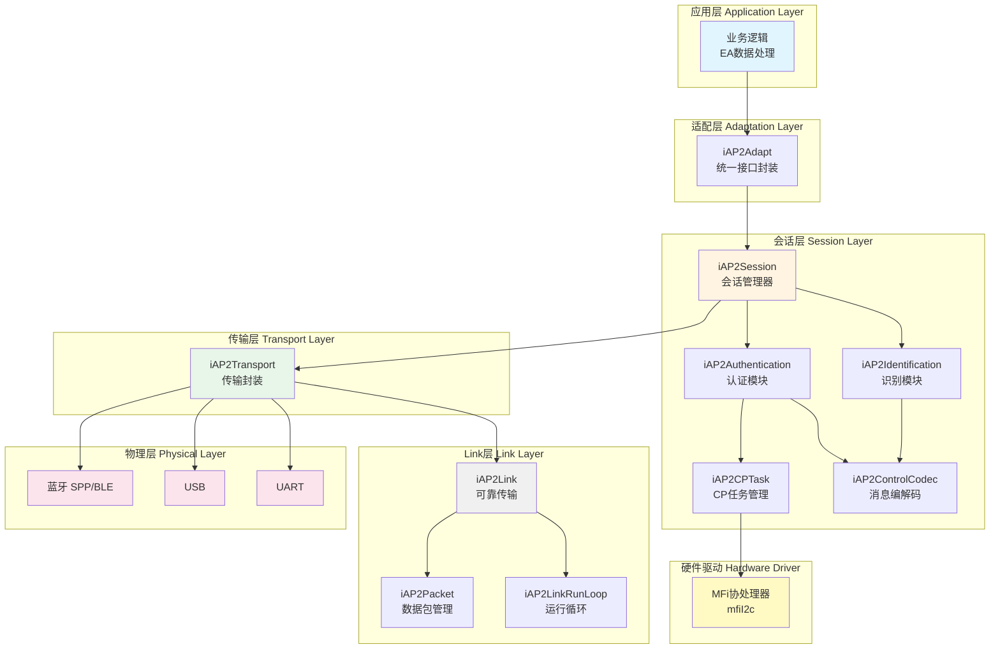

### 模块职责总览

| 层级 | 模块 | 主要职责 | 关键文件 |
|------|------|----------|----------|
| **应用层** | Application | 业务逻辑、EA数据处理 | 用户实现 |
| **适配层** | iAP2Adapt | 统一接口封装、简化调用 | iAP2Adapt.c/h |
| **会话层** | iAP2Session | 会话管理、认证识别协调 | iAP2Session.c/h |
| | iAP2Authentication | MFi认证流程 | iAP2Authentication.c/h |
| | iAP2Identification | 配件识别流程 | iAP2Identification.c/h |
| | iAP2CPTask | CP异步操作管理 | iAP2CPTask.c/h |
| | iAP2ControlCodec | 控制消息编解码 | iAP2ControlCodec.c/h |
| **Link层** | iAP2Link | 可靠传输、流量控制 | iAP2Link.c/h |
| | iAP2Packet | 数据包封装解析 | iAP2Packet.c/h |
| | iAP2LinkRunLoop | 运行循环管理 | iAP2LinkRunLoop.c/h |
| **传输层** | iAP2Transport | 物理传输封装 | iAP2Transport.c/h |
| **物理层** | Bluetooth/USB/UART | 物理通信 | 平台相关 |
| **硬件驱动** | MFi CP | 认证芯片驱动 | mfiI2c.c/h |
| **工具层** | iAP2Utility | FSM、缓冲池、时间等 | iAP2Utility/* |

---

## 模块详细分析

### 1. iAP2Adapt - 适配层

#### 架构图

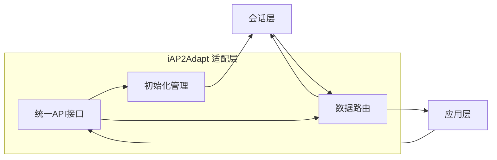

#### 主要功能

- **统一接口封装**：简化上层调用，隐藏底层复杂性
- **连接管理**：处理连接建立和断开
- **数据路由**：在应用层和会话层之间路由数据

#### 关键接口

```c
// 连接建立
int iAP2AdaptOnConnected(int type, 
                         iAP2SessionDataCB_t sessionDataCB,
                         iAP2TransportSendDataCB_t sendDataCB, 
                         void *context);

// 连接断开
void iAP2AdaptOnDisconnected(void);

// 数据处理
int iAP2AdaptDataHandler(unsigned char *data, unsigned int len);
```

---

### 2. iAP2Session - 会话层

#### 会话层架构图

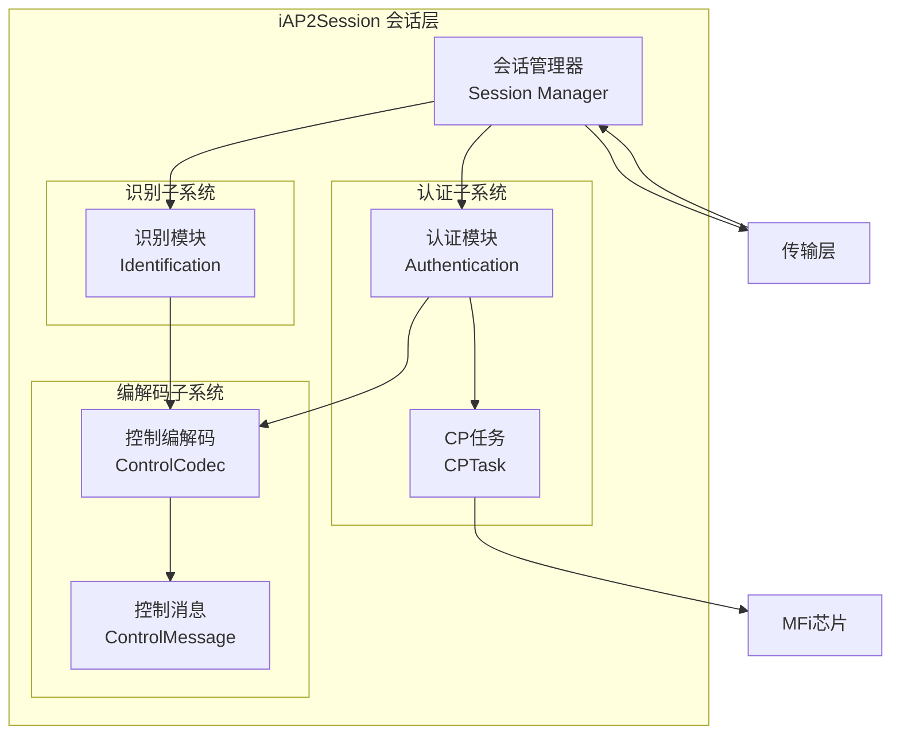

#### 会话管理器状态机

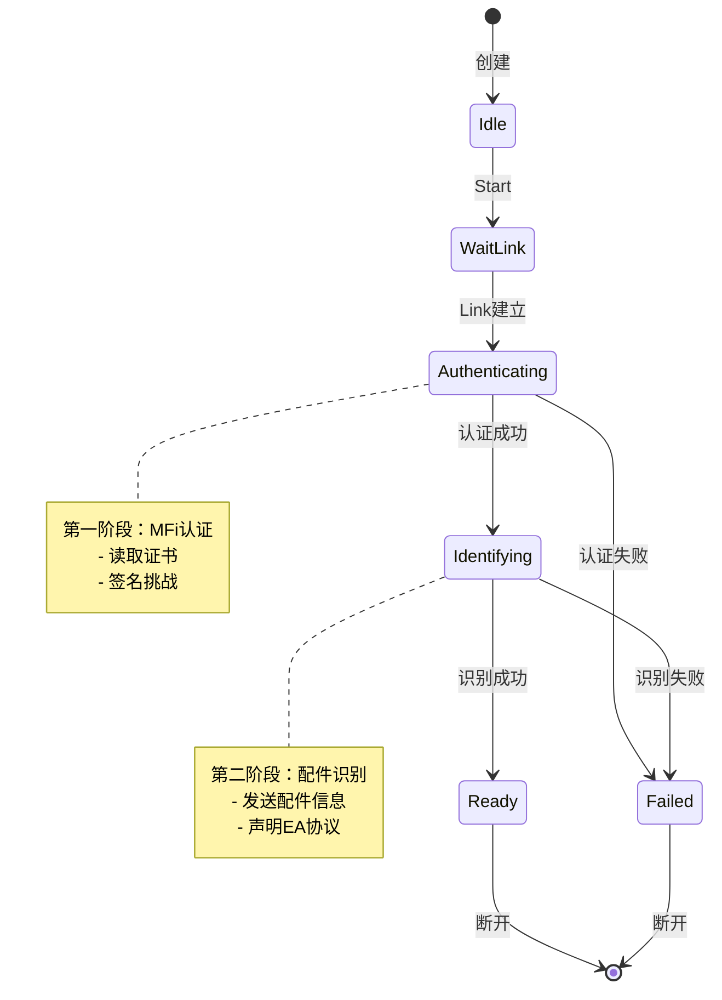

#### 主要功能

1. **会话管理**
   - Control Session（会话ID: 0x0A）：认证、识别、控制消息
   - EA Session：应用业务数据传输
   - Buffer Session：大数据传输（图片、健身数据等）

2. **认证流程**（iAP2Authentication）
   - 与MFi协处理器交互
   - 读取认证证书
   - 签名挑战数据
   - 异步非阻塞操作

3. **识别流程**（iAP2Identification）
   - 发送配件信息（名称、型号、制造商等）
   - 声明EA协议
   - 声明蓝牙传输信息
   - 声明消息能力

4. **CP任务管理**（iAP2CPTask）
   - 支持线程模式和轮询模式
   - 异步操作：读证书、签名挑战、读序列号
   - 回调通知机制

5. **消息编解码**（iAP2ControlCodec）
   - 统一的控制消息编解码接口
   - 支持多种参数类型：bool, int, enum, string, blob, array, group
   - 自动处理大小端转换

#### 关键接口

```c
// 会话管理器
iAP2Session_t* iAP2SessionCreate(const iAP2SessionConfig_t *config, uint8_t type);
BOOL iAP2SessionStart(iAP2Session_t *session);
BOOL iAP2SessionSendData(iAP2Session_t *session, uint8_t sessionID, 
                         const uint8_t *data, uint32_t dataLen);
BOOL iAP2SessionIsReady(iAP2Session_t *session);

// 会话注册
int iAP2SessionRegCtrl(iAP2PacketSYNData_t *p_syn_data);
int iAP2SessionRegEA(uint8_t eaSessionID, void *context);
```

---

### 3. iAP2Link - Link层

#### Link层架构图

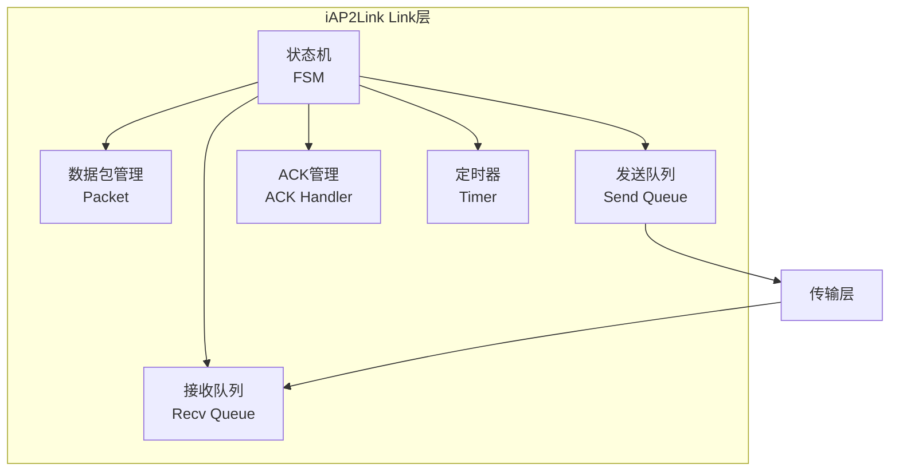

#### Link层状态机

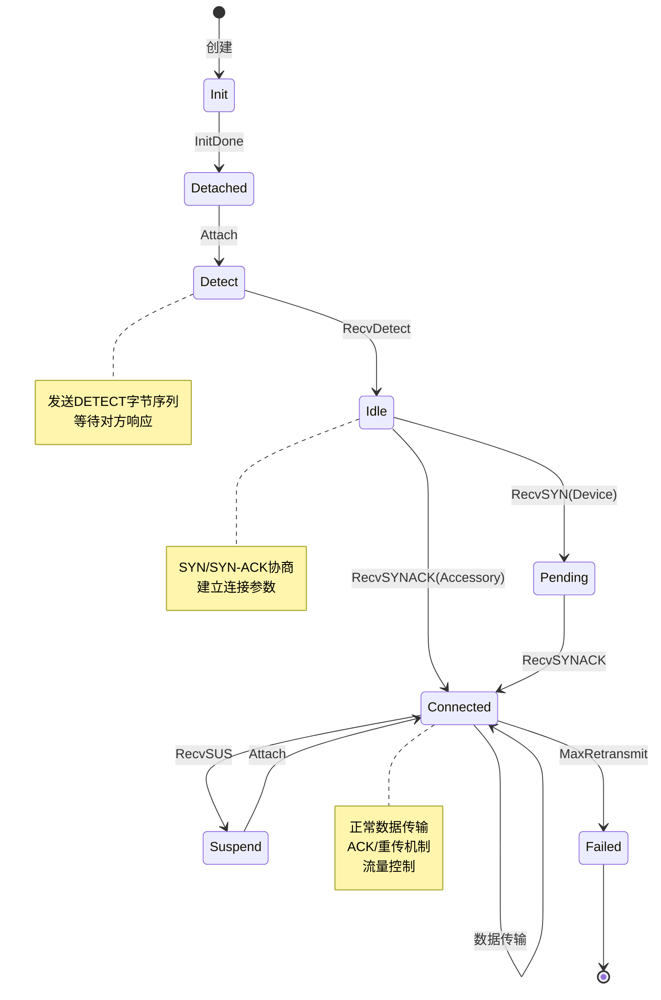

#### 主要功能

1. **可靠传输**
   - 序列号管理（SEQ/ACK）
   - 自动重传（ARQ）
   - 超时检测
   - 丢包检测和恢复

2. **流量控制**
   - 滑动窗口机制
   - 最大未确认包数限制
   - 拥塞避免

3. **数据包管理**
   - 分片和重组
   - 校验和计算
   - 包类型处理：SYN, ACK, EAK, RST, SUS, DATA

4. **会话复用**
   - 支持多个会话共享同一Link
   - 会话ID路由

#### 数据包格式

```
+--------+--------+--------+--------+--------+--------+--------+--------+--------+
| 0xFF   | 0x5A   | LEN_H  | LEN_L  | CTRL   | SEQ    | ACK    | SESS   | CHK    |
+--------+--------+--------+--------+--------+--------+--------+--------+--------+
|                          Payload Data (可变长度)                              |
+-------------------------------------------------------------------------------+
|                          Payload Checksum                                     |
+-------------------------------------------------------------------------------+

CTRL字段位定义：
- Bit 7: SYN (同步)
- Bit 6: ACK (确认)
- Bit 5: EAK (扩展确认)
- Bit 4: RST (重置)
- Bit 3: SUS (挂起)
```

#### 关键接口

```c
// Link创建和管理
iAP2Link_t* iAP2LinkCreateAccessory(iAP2PacketSYNData_t *synParam, ...);
void iAP2LinkStart(iAP2Link_t *link);
void iAP2LinkAttached(iAP2Link_t *link);
void iAP2LinkDetached(iAP2Link_t *link);

// 数据收发
BOOL iAP2LinkQueueSendData(iAP2Link_t *link, const uint8_t *payload, 
                           uint32_t payloadLen, uint8_t session, ...);
void iAP2LinkHandleReadyPacket(iAP2Link_t *link, iAP2Packet_t *packet);

// 数据包操作
iAP2Packet_t* iAP2PacketCreateEmptyRecvPacket(void *link);
uint32_t iAP2PacketParseBuffer(const uint8_t *buffer, uint32_t bufferLen, 
                               iAP2Packet_t *packet, ...);
BOOL iAP2PacketIsComplete(const iAP2Packet_t *pck);
```

---

### 4. iAP2Transport - 传输层

#### 传输层架构图

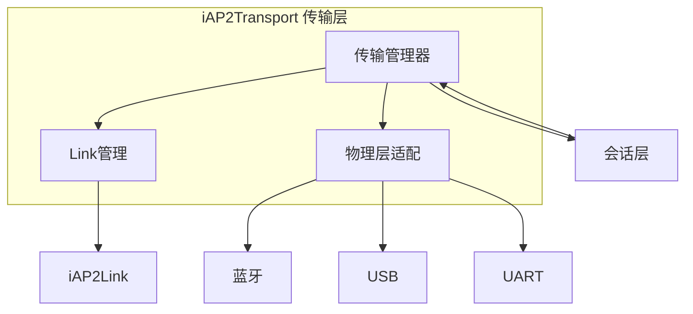

#### 主要功能

1. **物理传输封装**
   - 统一的传输接口
   - 支持多种物理层：蓝牙、USB、UART
   - 物理层切换

2. **Link层管理**
   - 创建和管理iAP2Link实例
   - 处理Link层回调
   - 数据路由

3. **连接管理**
   - 连接状态跟踪
   - 连接建立和断开
   - 重连机制

#### 关键接口

```c
// 传输层创建和管理
iAP2Transport_t* iAP2TransportCreate(const iAP2TransportConfig_t *config);
void iAP2TransportDestroy(iAP2Transport_t *transport);

// 连接管理
BOOL iAP2TransportConnect(iAP2Transport_t *transport);
void iAP2TransportDisconnect(iAP2Transport_t *transport);

// 数据收发
uint32_t iAP2TransportReceiveData(iAP2Transport_t *transport, 
                                  const uint8_t *data, uint32_t dataLen);
BOOL iAP2TransportSendData(iAP2Transport_t *transport, uint8_t sessionID, 
                           const uint8_t *data, uint32_t dataLen);

// 处理循环
BOOL iAP2TransportProcess(iAP2Transport_t *transport);

// 状态查询
BOOL iAP2TransportIsConnected(iAP2Transport_t *transport);
iAP2TransportState_t iAP2TransportGetState(iAP2Transport_t *transport);
```

---

### 5. iAP2Utility - 工具层

#### 工具层组件

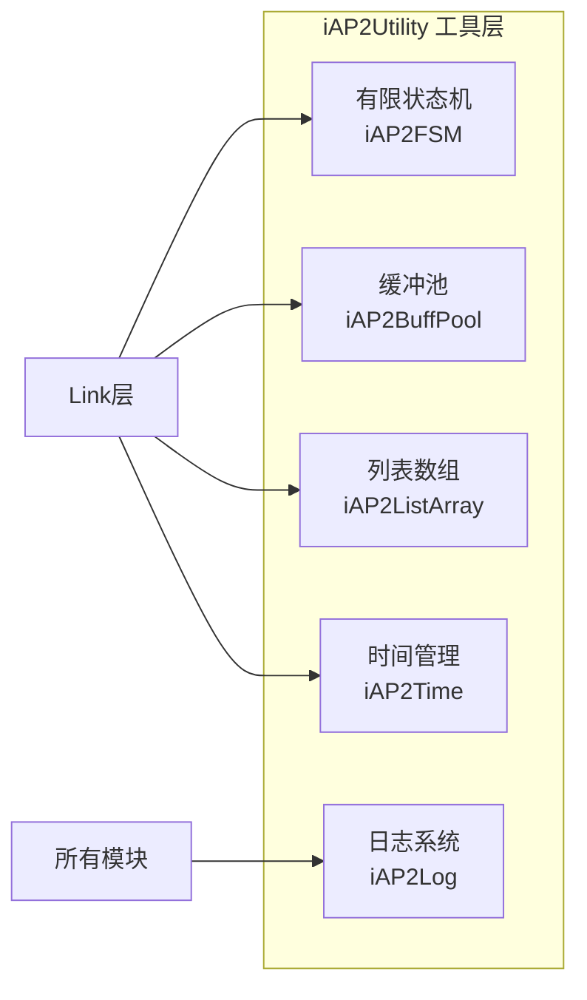

#### 主要组件

1. **iAP2FSM - 有限状态机**
   - 通用状态机框架
   - 状态转换表驱动
   - 事件处理机制
   - 用于Link层状态管理

2. **iAP2BuffPool - 缓冲池**
   - 内存池管理
   - 避免频繁malloc/free
   - 支持多种缓冲类型：通用缓冲、发送包、接收包

3. **iAP2ListArray - 列表数组**
   - 动态数组实现
   - 用于管理数据包队列

4. **iAP2Time - 时间管理**
   - 定时器抽象
   - 超时检测
   - 平台相关实现

5. **iAP2Log - 日志系统**
   - 分级日志：ERROR, WARNING, INFO, DEBUG
   - 可配置输出级别

---

## 数据流分析

### 接收数据流

```mermaid
sequenceDiagram
    participant PHY as 物理层<br/>(蓝牙/USB)
    participant TRANS as 传输层<br/>iAP2Transport
    participant LINK as Link层<br/>iAP2Link
    participant PKT as 数据包<br/>iAP2Packet
    participant SESS as 会话层<br/>iAP2Session
    participant APP as 应用层
    
    PHY->>TRANS: 接收原始数据
    TRANS->>PKT: 创建接收包
    TRANS->>PKT: 解析数据
    PKT-->>TRANS: 解析状态
    
    alt 包完整
        TRANS->>LINK: 处理完整包
        LINK->>LINK: 验证SEQ/ACK
        LINK->>LINK: 更新窗口
        
        alt 有payload
            LINK->>SESS: 路由到会话
            
            alt Control Session
                SESS->>SESS: 处理控制消息
                alt 认证消息
                    SESS->>SESS: 认证流程
                else 识别消息
                    SESS->>SESS: 识别流程
                end
            else EA Session
                SESS->>APP: 转发EA数据
            end
        end
        
        LINK->>TRANS: 发送ACK
        TRANS->>PHY: 发送ACK包
    else 包不完整
        TRANS->>TRANS: 继续接收
    end
```

### 发送数据流

```mermaid
sequenceDiagram
    participant APP as 应用层
    participant SESS as 会话层<br/>iAP2Session
    participant LINK as Link层<br/>iAP2Link
    participant PKT as 数据包<br/>iAP2Packet
    participant TRANS as 传输层<br/>iAP2Transport
    participant PHY as 物理层<br/>(蓝牙/USB)
    
    APP->>SESS: 发送EA数据
    SESS->>SESS: 检查会话状态
    
    alt 会话就绪
        SESS->>TRANS: 发送数据+会话ID
        TRANS->>LINK: 队列发送数据
        LINK->>LINK: 检查发送窗口
        
        alt 窗口可用
            LINK->>PKT: 创建数据包
            PKT->>PKT: 填充payload
            PKT->>PKT: 设置SEQ/ACK
            PKT->>PKT: 计算校验和
            PKT->>PKT: 生成字节流
            
            LINK->>LINK: 加入发送队列
            LINK->>LINK: 启动重传定时器
            LINK->>TRANS: 发送回调
            TRANS->>PHY: 发送字节流
            
            PHY-->>TRANS: 接收ACK
            TRANS->>LINK: 处理ACK
            LINK->>LINK: 更新窗口
            LINK->>LINK: 停止定时器
            LINK->>PKT: 删除已确认包
        else 窗口满
            LINK->>LINK: 等待ACK
        end
    else 会话未就绪
        SESS-->>APP: 返回错误
    end
```

---

## 时序图

### 完整连接建立流程

```mermaid
sequenceDiagram
    participant DEV as iOS设备
    participant PHY as 物理层
    participant TRANS as 传输层
    participant LINK as Link层
    participant SESS as 会话层
    participant AUTH as 认证模块
    participant CP as MFi芯片
    participant IDENT as 识别模块
    participant APP as 应用层
    
    Note over DEV,APP: 阶段1: 物理连接
    DEV->>PHY: 蓝牙/USB连接
    PHY->>TRANS: 连接事件
    TRANS->>LINK: Attached
    
    Note over DEV,APP: 阶段2: Link协商
    LINK->>PHY: 发送DETECT
    DEV->>PHY: 发送DETECT响应
    PHY->>LINK: 接收DETECT
    
    LINK->>PHY: 发送SYN
    DEV->>PHY: 发送SYN-ACK
    PHY->>LINK: 接收SYN-ACK
    LINK->>LINK: 状态→Connected
    LINK->>SESS: Link已建立
    
    Note over DEV,APP: 阶段3: 认证流程
    SESS->>AUTH: 启动认证
    DEV->>SESS: RequestAuthCertificate (0xAA00)
    AUTH->>CP: 读取证书
    CP-->>AUTH: 证书数据
    AUTH->>DEV: AuthCertificate (0xAA01)
    
    DEV->>AUTH: RequestAuthChallenge (0xAA02)
    AUTH->>CP: 签名挑战
    CP-->>AUTH: 签名响应
    AUTH->>DEV: AuthResponse (0xAA03)
    
    DEV->>AUTH: AuthSucceeded (0xAA05)
    AUTH->>SESS: 认证完成
    SESS->>APP: 认证成功回调
    
    Note over DEV,APP: 阶段4: 识别流程
    DEV->>IDENT: StartIdentification (0x1D00)
    IDENT->>IDENT: 准备配件信息
    IDENT->>DEV: IdentificationInfo (0x1D01)
    Note right of IDENT: 包含：名称、型号<br/>EA协议、蓝牙信息<br/>消息能力
    
    DEV->>IDENT: IdentificationAccepted (0x1D02)
    IDENT->>SESS: 识别完成
    SESS->>SESS: 状态→Ready
    SESS->>APP: 识别成功回调
    
    Note over DEV,APP: 阶段5: 正常通信
    APP->>SESS: 发送EA数据
    SESS->>LINK: 发送数据
    LINK->>DEV: 数据包
    DEV->>APP: EA数据
```

### 认证流程详细时序

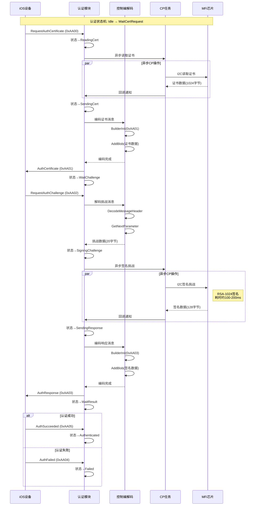

### 识别流程详细时序

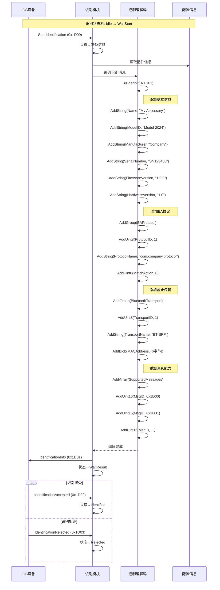

---

## 状态机分析

### Link层状态机详细分析

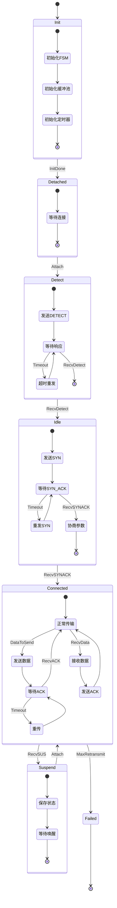

### 认证模块状态机

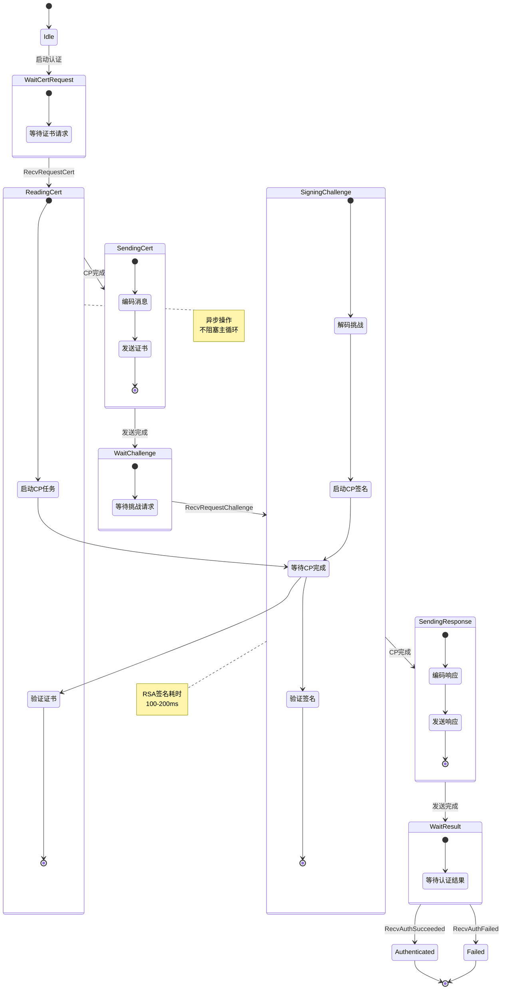

### 识别模块状态机

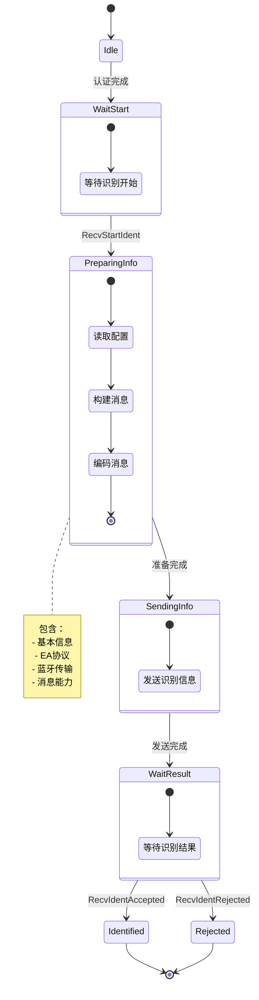

---

## 关键设计模式

### 1. 分层架构模式

**优点**：
- 职责清晰，易于维护
- 层间解耦，便于替换
- 复用性高

**实现**：
```
应用层 → 会话层 → Link层 → 传输层 → 物理层
```

每层只依赖下层，通过回调向上通知。

### 2. 状态机模式

**应用场景**：
- Link层连接管理
- 认证流程控制
- 识别流程控制

**实现**：使用iAP2FSM通用状态机框架

```c
typedef struct {
    const iAP2FSMState_t *states;
    unsigned int stateCount;
    unsigned int eventCount;
    unsigned int currentState;
    void *data;
} iAP2FSM_t;
```

**优点**：
- 状态转换清晰
- 易于调试
- 可扩展

### 3. 回调模式

**应用场景**：
- 层间通信
- 异步操作通知
- 事件处理

**示例**：
```c
// 数据接收回调
typedef BOOL (*iAP2LinkDataReadyCB_t)(
    struct iAP2Link_st *link,
    uint8_t *data,
    uint32_t dataLen,
    uint8_t session
);

// 连接状态回调
typedef void (*iAP2LinkConnectedCB_t)(
    struct iAP2Link_st *link,
    BOOL bConnected
);
```

### 4. 对象池模式

**应用场景**：
- 数据包缓冲管理
- 避免频繁内存分配

**实现**：iAP2BuffPool

```c
typedef struct {
    uint8_t type;
    uint16_t buffCount;
    uint32_t buffSize;
    uintptr_t context;
    uintptr_t data;
} iAP2BuffPool_t;

void* iAP2BuffPoolGet(iAP2BuffPool_t *buffPool, uintptr_t param);
void iAP2BuffPoolReturn(iAP2BuffPool_t *buffPool, void *buff);
```

**优点**：
- 减少内存碎片
- 提高性能
- 可预测的内存使用

### 5. 生产者-消费者模式

**应用场景**：
- 发送队列管理
- 接收队列管理

**实现**：
```
应用层(生产者) → 发送队列 → Link层(消费者) → 物理层
物理层 → 接收队列 → Link层(生产者) → 会话层(消费者)
```

### 6. 策略模式

**应用场景**：
- 不同物理层适配
- 不同传输类型处理

**实现**：
```c
typedef enum {
    kIAP2TransportTypeBluetooth = 0,
    kIAP2TransportTypeUSB,
    kIAP2TransportTypeUART
} iAP2TransportType_t;
```

每种传输类型有不同的实现策略。

---

## 关键技术点

### 1. 可靠传输机制

#### 滑动窗口协议

```
发送窗口：
┌─────┬─────┬─────┬─────┬─────┬─────┬─────┬─────┐
│ ACK │ ACK │SENT │SENT │READY│READY│ ... │ ... │
└─────┴─────┴─────┴─────┴─────┴─────┴─────┴─────┘
        ↑           ↑           ↑
      sentAck    sentSeq    窗口末端

接收窗口：
┌─────┬─────┬─────┬─────┬─────┬─────┬─────┬─────┐
│ ACK │ ACK │RECV │ ... │ ... │ ... │ ... │ ... │
└─────┴─────┴─────┴─────┴─────┴─────┴─────┴─────┘
        ↑           ↑
      recvAck    recvSeq
```

#### 重传机制

1. **超时重传**：
   - 发送数据包后启动定时器
   - 超时未收到ACK则重传
   - 最多重传maxRetransmit次

2. **快速重传**：
   - 收到EAK（扩展确认）
   - 立即重传丢失的包

3. **累积确认**：
   - 可以一次确认多个包
   - 减少ACK包数量

### 2. 流量控制

#### 窗口管理

```c
// 检查发送窗口是否可用
BOOL iAP2LinkSendWindowAvailable(iAP2Link_t *link) {
    uint8_t outstanding = (link->sentSeq - link->sentAck) & 0xFF;
    return (outstanding < link->param.maxOutstandingPackets);
}
```

#### 拥塞避免

- 限制最大未确认包数
- 动态调整发送速率
- 避免接收方缓冲区溢出

### 3. 异步非阻塞设计

#### CP操作异步化

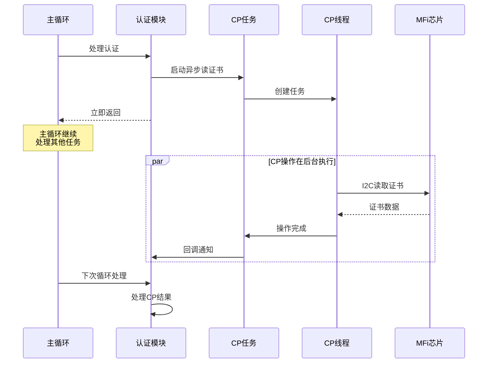

**优点**：
- 主循环不阻塞
- 提高响应性
- 充分利用CPU

### 4. 消息编解码

#### 统一编解码接口

```c
// 编码
ctrlSess_BuilderInit(&builder, buffer, size, msgId);
ctrlSess_AddString(&builder, paramId, "value");
ctrlSess_AddBlob(&builder, paramId, data, len);
ctrlSess_AddUint16(&builder, paramId, value);
uint16_t msgLen = ctrlSess_BuilderFinish(&builder);

// 解码
ctrlSess_DecodeMessageHeader(data, len, &msg);
while (remaining > 0) {
    ctrlSessParameter param;
    int consumed = ctrlSess_GetNextParameter(ptr, remaining, &param);
    // 处理参数
}
```

**优点**：
- 避免手动构造消息
- 自动处理大小端
- 减少错误
- 易于维护

---

## 性能优化

### 1. 内存优化

- **预分配缓冲池**：避免运行时malloc
- **零拷贝**：尽可能使用指针传递
- **缓冲复用**：对象池模式

### 2. CPU优化

- **异步操作**：CP操作不阻塞主循环
- **批量处理**：累积确认减少包数量
- **快速路径**：常见情况优化

### 3. 网络优化

- **流量控制**：避免拥塞
- **快速重传**：减少延迟
- **窗口调整**：动态适应网络状况

---

## 调试和诊断

### 1. 日志系统

```c
#define IAP2_LOG_ERROR(...)   // 错误日志
#define IAP2_LOG_WARNING(...) // 警告日志
#define IAP2_LOG_INFO(...)    // 信息日志
#define IAP2_LOG_DEBUG(...)   // 调试日志
```

### 2. 状态查询

```c
// 会话状态
const char* iAP2SessionGetStateString(iAP2Session_t *session);
BOOL iAP2SessionIsAuthenticated(iAP2Session_t *session);
BOOL iAP2SessionIsIdentified(iAP2Session_t *session);
BOOL iAP2SessionIsReady(iAP2Session_t *session);

// Link状态
BOOL iAP2LinkIsDetached(iAP2Link_t *link);
iAP2TransportState_t iAP2TransportGetState(iAP2Transport_t *transport);
```

### 3. 统计信息

```c
typedef struct {
    uint32_t bytesSent;
    uint32_t bytesRcvd;
    uint32_t packetsSent;
    uint32_t packetsRcvd;
    uint32_t noAckReTxCount;
    uint32_t missingReTxCount;
    uint32_t invalidPackets;
    uint32_t numOutOfOrder;
} iAP2LinkStats_t;
```

---

## 常见问题和解决方案

### Q1: 认证失败

**可能原因**：
1. MFi芯片未正确初始化
2. 证书读取失败
3. 挑战签名错误
4. 超时

**解决方案**：
1. 检查I2C通信
2. 验证证书数据
3. 增加超时时间
4. 查看AuthFailed错误码

### Q2: 识别被拒绝

**可能原因**：
1. 配件信息不完整
2. EA协议配置错误
3. 消息能力不匹配

**解决方案**：
1. 检查所有必填字段
2. 验证EA协议ID和名称
3. 确认支持的消息列表

### Q3: 数据传输失败

**可能原因**：
1. 会话未就绪
2. Link未连接
3. 发送窗口满
4. 物理层断开

**解决方案**：
1. 检查会话状态
2. 验证Link连接
3. 等待ACK释放窗口
4. 检查物理连接

### Q4: CP操作超时

**可能原因**：
1. I2C通信失败
2. MFi芯片无响应
3. 超时设置过短

**解决方案**：
1. 检查I2C配置
2. 重置MFi芯片
3. 增加超时时间
4. 检查硬件连接

---

## 最佳实践

### 1. 初始化顺序

```c
// 1. 初始化MFi芯片
mfiI2cInit();

// 2. 创建传输层
iAP2Transport_t *transport = iAP2TransportCreate(&config);

// 3. 创建会话层
iAP2Session_t *session = iAP2SessionCreate(&sessionConfig, type);

// 4. 启动会话
iAP2SessionStart(session);

// 5. 物理连接建立后
iAP2TransportConnect(transport);
```

### 2. 主循环设计

```c
while (running) {
    // 1. 处理物理层事件
    ProcessPhysicalLayer();
    
    // 2. 处理传输层
    iAP2TransportProcess(transport);
    
    // 3. 处理应用逻辑
    ProcessApplication();
    
    // 4. 短暂延时
    usleep(10000); // 10ms
}
```

### 3. 错误处理

```c
// 检查返回值
if (!iAP2SessionSendData(session, sessionID, data, len)) {
    // 处理发送失败
    if (!iAP2SessionIsReady(session)) {
        // 会话未就绪
    } else {
        // 其他错误
    }
}

// 使用回调处理异步错误
void AuthCompleteCallback(BOOL success, void *context) {
    if (!success) {
        // 认证失败处理
    }
}
```

### 4. 资源管理

```c
// 创建时分配
iAP2Session_t *session = iAP2SessionCreate(&config, type);

// 使用...

// 销毁时释放
iAP2SessionDestroy(session);
iAP2TransportDestroy(transport);
```

---

## 总结

iAP2协议栈是一个设计精良的分层架构系统，具有以下特点：

### 优点

1. **分层清晰**：职责明确，易于维护和扩展
2. **状态机驱动**：逻辑清晰，易于调试
3. **异步非阻塞**：高性能，不阻塞主循环
4. **可靠传输**：完善的重传和流量控制机制
5. **统一编解码**：减少错误，提高可维护性
6. **模块化设计**：高内聚低耦合，易于复用

### 适用场景

- 车载娱乐系统
- 智能家居设备
- 音频设备
- 健身设备
- 其他需要与iOS设备通信的配件

### 扩展性

- 支持多种物理层：蓝牙、USB、UART
- 支持多个EA协议
- 可自定义消息处理
- 易于添加新功能

---

## 参考资料

1. **Apple MFi规范**
   - iAP2协议规范
   - MFi认证指南
   - 配件设计指南

2. **代码文档**
   - README.txt
   - doc/ARCHITECTURE_SUMMARY.md
   - doc/README_Architecture.md
   - 各模块头文件注释

3. **相关标准**
   - 蓝牙SPP协议
   - USB通信协议
   - I2C总线协议

---

**文档版本**: 1.0  
**最后更新**: 2026-01-29  
**作者**: Kiro AI Assistant
